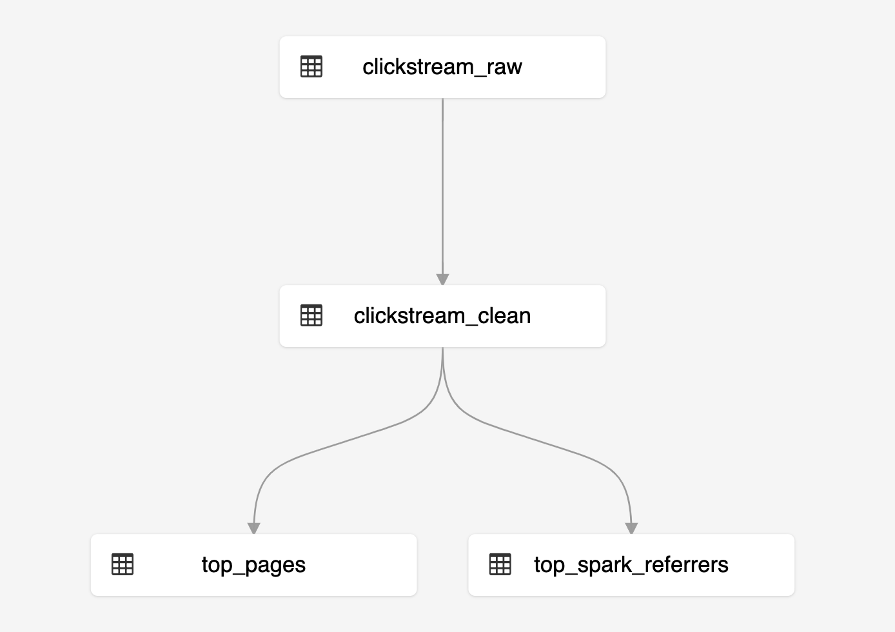

<h1>Delta Live Tables Example Notebooks</h1>

<p align="center">
  <br>
  <strong>Delta Live Tables</strong> is a new framework designed to enable customers to successfully declaratively define, deploy, test & upgrade data pipelines and eliminate operational burdens associated with the management of such pipelines.
</p>
<p align="center">
  This repo contains Delta Live Table examples designed to get customers started with
  building, deploying and running pipelines.
</p>

# Getting Started

* Connect your Databricks workspace using the  feature to [this repo](https://github.com/databricks/delta-live-tables-notebooks)

* Choose one of the examples and create your pipeline!

# Examples
## Wikipedia
The Wikipedia clickstream sample is a great way to jump start using Delta Live Tables (DLT).  It is a simple bificating pipeline that creates a table on your JSON data, cleanses the data, and then creates two tables.  



This sample is available for both [SQL](https://github.com/databricks/delta-live-tables-notebooks/blob/main/sql/Wikipedia.sql) and [Python](https://github.com/databricks/delta-live-tables-notebooks/blob/main/python/Wikipedia.py).


### Running your pipeline

**1. Create your pipeline using the following parameters**

  * From your Databricks workspace, click **Jobs**, then **Delta Live Tables** and click on **Create Pipeline**
  * Fill in the **Pipeline Name**, e.g. `Wikipedia`
  * For the **Notebook Libraries**, fill in the path of the notebook such as `/Repos/michael@databricks.com/delta-live-tables-notebooks/SQL/Wikipedia`
    
    
  * To publish your tables, add the `target` parameter to specify which database you want to persist your tables, e.g. `wiki_demo`.


**2. Edit your pipeline JSON**

  * Once you have setup your pipeline, click **Edit Settings** near the top, the JSON will look similar to below

      


**3. Click Start**

  * To view the progress of your pipeline, refer to the progress flow near the bottom of the pipeline details UI as noted in the following image. 

    


**4. Reviewing the results**

  * Once your pipeline has completed processing, you can review the data by opening up a new Databricks notebook and running the following SQL statements:

    ```
    %sql
    -- Review the top referrers to Wikipedia's Apache Spark articles
    SELECT * FROM wiki_demo.top_spark_referers
    ```

  * Unsurprisingly, the top referrer is "Google" which you can see graphically when you convert your table into an area chart.
  
    


