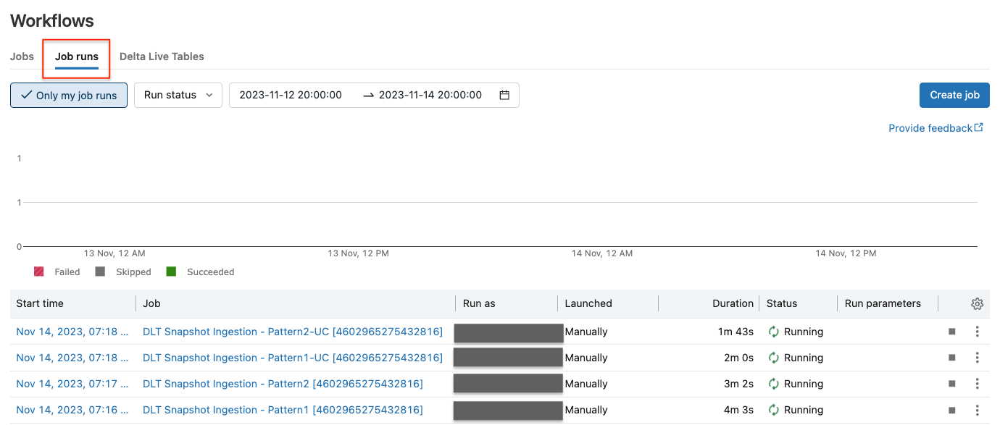

# DLT APPLY CHANGES FROM SNAPSHOT

When you run `databricks bundle deploy`, it will deploy two jobs:
* DLT Snapshot Ingestion - Pattern1 [<USER_ID>]
* DLT Snapshot Ingestion - Pattern2 [<USER_ID>]

Each job has two tasks:
* generate_orders_snapshot: This is a Python notebook task that generates synthetic orders snapshot data. 
  * For Pattern 1, the snapshot data will be written to a delta table
  * For Pattern 2, each snapshot will be written to a unique DBFS or UC Volume path. 
* cdc_from_snapshot: This is a DLT pipeline that processes the snapshot data and applies the changes to the target table. 
 


## How to run this demo

### Pre-requisites
1) **Databricks CLI**: You'll need to install databricks cli on your local machine. See [here](https://docs.databricks.com/en/dev-tools/cli/install.html) for instructions. The minimum version of Databricks CLI required is `v0.208.2`. You can run `databricks -v` 
to check the CLI version.
2) **Authentication**: You'll need to authenticate with Databricks CLI. You can do this by running `databricks configure token --profle <my_profile_name>` and providing the host and token value when prompted or by setting the following environment variables:
```bash

export DATABRICKS_HOST=<MYWORKSPACE>.cloud.databricks.com
export DATABRICKS_TOKEN=<MY_DATABRICKS_TOKEN>
```
If you are using databricks CLI profiles for authentication, then you'll need to pass the `--profile <my_profile_name>` option to the databricks CLI commands.

Databricks provides serveral other authentication methods. See [here](https://docs.databricks.com/dev-tools/api/latest/authentication.html) for more details.

### Deploy and run the workflow
If you **do not have Unit Catalog** enabled workspace, run the following commands from the root of the repo:
```bash
cd apply-changes-from-snapshot-demo
databricks bundle validate --target development
databricks bundle deploy --target development
databricks bundle run dlt_snapshot_ingestion_pattern1_job --target development
databricks bundle run dlt_snapshot_ingestion_pattern2_job --target development
```

If you have **Unity Catalog** enabled workspace, run the following commands from the root of the repo:
```bash
cd apply-changes-from-snapshot-demo
databricks bundle validate --target development-uc
databricks bundle deploy --target development-uc
databricks bundle run dlt_snapshot_ingestion_pattern1_job --target development-uc
databricks bundle run dlt_snapshot_ingestion_pattern2_job --target development-uc
```

### Notes
* If you want to deploy and run in Azure Databricks workspace, you can either change the `default` value for the variable `my_node_type_id` in the `databricks.yaml` file to `Standard_DS3_v2` or you can pass the the value as an argument to the `databricks bundle deploy` command. For example, `databricks bundle deploy --var="my_node_type_id=Standard_DS3_v2"`
* `databricks bundle run` command runs the job and waits for it to finish. If you want to run all of them, you'll need to run each `databricks bundle run` command in the new terminal.

* You can also go to your Databricks Workspace and navigate to `Workflows` page and click `Jobs`and find the job .You can either trigger the run manually or scheduled them to run hourly.

* For Pattern 2, snapshots are generated at hour granularity. So, you'll need to run the job hourly. If you run the job multiple times in the same hour, you'll essentially overwrite the same snapshot. To generate a new snapshot, you'll need to wait for the next hour to start.
You could also modify the job settings to run it hourly.

* To view the Job runs, you can go to your Databricks workspace and go to `Workflow` and `Job runs`. You can further filter the job runs by clicking on `Only my job runs` and you should see the job your runs as shown below.

