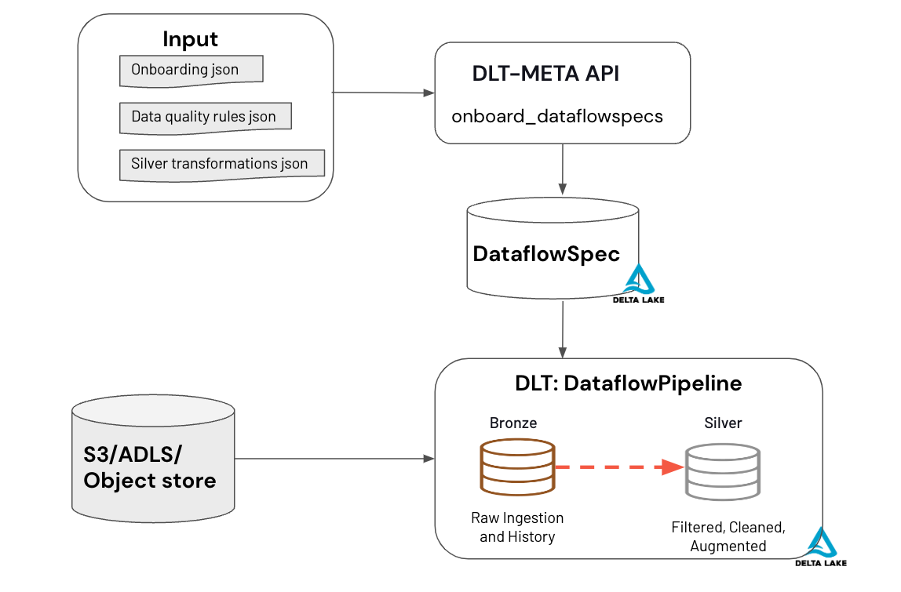
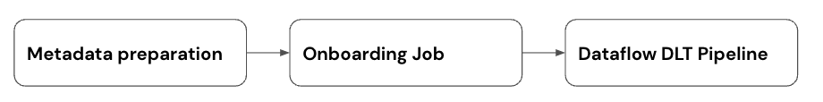
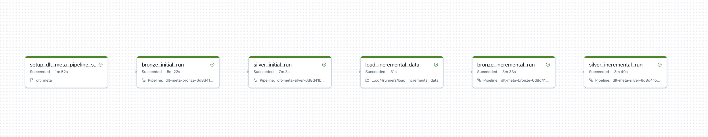
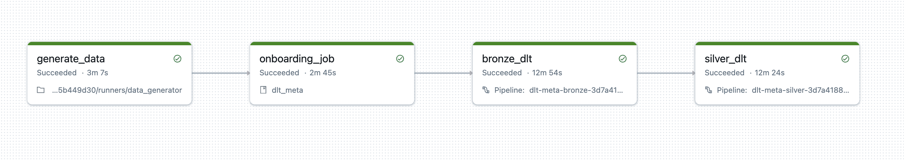
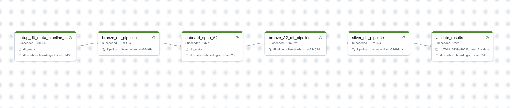
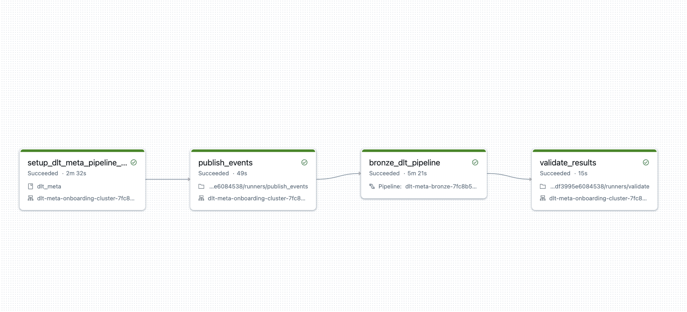
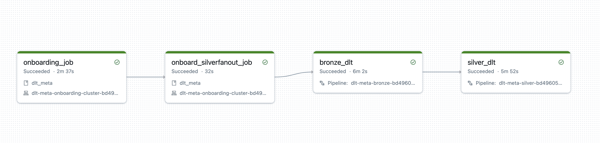
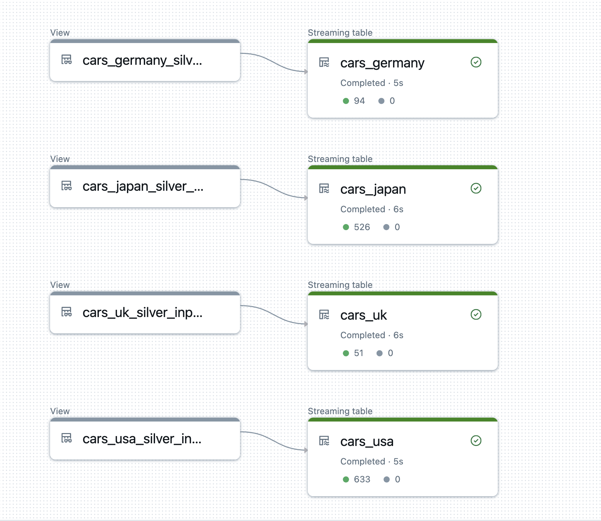
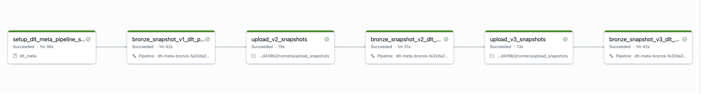

 # [DLT-META](https://github.com/databrickslabs/dlt-meta) Project Overview
`DLT-META` is a metadata-driven framework designed to work with [Delta Live Tables](https://www.databricks.com/product/delta-live-tables). This framework enables the automation of bronze and silver data pipelines by leveraging metadata recorded in an onboarding JSON file. This file, known as the Dataflowspec, serves as the data flow specification, detailing the source and target metadata required for the pipelines.

In practice, a single generic DLT pipeline reads the Dataflowspec and uses it to orchestrate and run the necessary data processing workloads. This approach streamlines the development and management of data pipelines, allowing for a more efficient and scalable data processing workflow

### Components:

#### Metadata Interface

- Capture input/output metadata in [onboarding file](https://github.com/databrickslabs/dlt-meta/blob/main/examples/onboarding.template)
- Capture [Data Quality Rules](https://github.com/databrickslabs/dlt-meta/tree/main/examples/dqe/customers/bronze_data_quality_expectations.json)
- Capture processing logic as sql in [Silver transformation file](https://github.com/databrickslabs/dlt-meta/blob/main/examples/silver_transformations.json)

#### Generic DLT pipeline

- Apply appropriate readers based on input metadata
- Apply data quality rules with DLT expectations
- Apply CDC apply changes if specified in metadata
- Builds DLT graph based on input/output metadata
- Launch DLT pipeline

## High-Level Process Flow:



## Steps



## DLT-META DLT Features support
| Features  | DLT-META Support |
| ------------- | ------------- |
| Input data sources  | Autoloader, Delta, Eventhub, Kafka, snapshot  |
| Medallion architecture layers | Bronze, Silver  |
| Custom transformations | Bronze, Silver layer accepts custom functions|
| Data Quality Expecations Support | Bronze, Silver layer |
| Quarantine table support | Bronze layer |
| [apply_changes](https://docs.databricks.com/en/delta-live-tables/python-ref.html#cdc) API support | Bronze, Silver layer | 
| [apply_changes_from_snapshot](https://docs.databricks.com/en/delta-live-tables/python-ref.html#change-data-capture-from-database-snapshots-with-python-in-delta-live-tables) API support | Bronze layer|
| [append_flow](https://docs.databricks.com/en/delta-live-tables/flows.html#use-append-flow-to-write-to-a-streaming-table-from-multiple-source-streams) API support | Bronze layer|
| Liquid cluster support | Bronze, Bronze Quarantine, Silver tables|
| [DLT-META CLI](https://databrickslabs.github.io/dlt-meta/getting_started/dltmeta_cli/) |  ```databricks labs dlt-meta onboard```, ```databricks labs dlt-meta deploy``` |
| Bronze and Silver pipeline chaining | Deploy dlt-meta pipeline with ```layer=bronze_silver``` option using Direct publishing mode |

## Getting Started

Refer to the [Getting Started](https://databrickslabs.github.io/dlt-meta/getting_started)
 # [DLT-META](https://github.com/databrickslabs/dlt-meta) DEMO
 1. [DAIS 2023 DEMO](#dais-2023-demo): Showcases DLT-META's capabilities of creating Bronze and Silver DLT pipelines with initial and incremental mode automatically.
 2. [Databricks Techsummit Demo](#databricks-tech-summit-fy2024-demo): 100s of data sources ingestion in bronze and silver DLT pipelines automatically.
 3. [Append FLOW Autoloader Demo](#append-flow-autoloader-file-metadata-demo): Write to same target from multiple sources using [dlt.append_flow](https://docs.databricks.com/en/delta-live-tables/flows.html#append-flows)  and adding [File metadata column](https://docs.databricks.com/en/ingestion/file-metadata-column.html)
 4. [Append FLOW Eventhub Demo](#append-flow-eventhub-demo): Write to same target from multiple sources using [dlt.append_flow](https://docs.databricks.com/en/delta-live-tables/flows.html#append-flows)  and adding [File metadata column](https://docs.databricks.com/en/ingestion/file-metadata-column.html)
 5. [Silver Fanout Demo](#silver-fanout-demo): This demo showcases the implementation of fanout architecture in the silver layer.
 6. [Apply Changes From Snapshot Demo](#Apply-changes-from-snapshot-demo): This demo showcases the implementation of ingesting from snapshots in bronze layer

The source argument is optional for the demos.


# DAIS 2023 DEMO
## [DAIS 2023 Session Recording](https://www.youtube.com/watch?v=WYv5haxLlfA)
This Demo launches Bronze and Silver DLT pipelines with following activities:
- Customer and Transactions feeds for initial load
- Adds new feeds Product and Stores to existing Bronze and Silver DLT pipelines with metadata changes.
- Runs Bronze and Silver DLT for incremental load for CDC events

### Steps:
1. Launch Command Prompt

2. Install [Databricks CLI](https://docs.databricks.com/dev-tools/cli/index.html)

3. ```commandline
    git clone https://github.com/databrickslabs/dlt-meta.git
    ```

4. ```commandline
    cd dlt-meta
    ```

5. Set python environment variable into terminal
    ```commandline
    dlt_meta_home=$(pwd)
    ```

    ```commandline
    export PYTHONPATH=$dlt_meta_home
    ```

6. ```commandline
    python demo/launch_dais_demo.py --uc_catalog_name=<<uc catalog name>> --profile=<<DEFAULT>>
    ```
    - uc_catalog_name : Unity catalog name
    - you can provide `--profile=databricks_profile name` in case you already have databricks cli otherwise command prompt will ask host and token.

    

# Databricks Tech Summit FY2024 DEMO:
This demo will launch auto generated tables(100s) inside single bronze and silver DLT pipeline using dlt-meta.

1. Launch Command Prompt

2. Install [Databricks CLI](https://docs.databricks.com/dev-tools/cli/index.html)

3. ```commandline
    git clone https://github.com/databrickslabs/dlt-meta.git
    ```

4. ```commandline
    cd dlt-meta
    ```

5. Set python environment variable into terminal
    ```commandline
    dlt_meta_home=$(pwd)
    ```

    ```commandline
    export PYTHONPATH=$dlt_meta_home
    ```

6. ```commandline
    python demo/launch_techsummit_demo.py --uc_catalog_name=<<uc catalog name>> --profile=<<DEFAULT>>
    ```
    - uc_catalog_name : Unity catalog name
    - you can provide `--profile=databricks_profile name` in case you already have databricks cli otherwise command prompt will ask host and token

    


# Append Flow Autoloader file metadata demo:
This demo will perform following tasks:
- Read from different source paths using autoloader and write to same target using append_flow API
- Read from different delta tables and write to same silver table using append_flow API
- Add file_name and file_path to target bronze table for autoloader source using [File metadata column](https://docs.databricks.com/en/ingestion/file-metadata-column.html)

1. Launch Command Prompt

2. Install [Databricks CLI](https://docs.databricks.com/dev-tools/cli/index.html)

3. ```commandline
    git clone https://github.com/databrickslabs/dlt-meta.git
    ```

4. ```commandline
    cd dlt-meta
    ```

5. Set python environment variable into terminal
    ```commandline
    dlt_meta_home=$(pwd)
    ```

    ```commandline
    export PYTHONPATH=$dlt_meta_home
    ```

6. ```commandline
    python demo/launch_af_cloudfiles_demo.py --uc_catalog_name=<<uc catalog name>> --source=cloudfiles --profile=<<DEFAULT>>
    ```
    - uc_catalog_name : Unity Catalog name
    - you can provide `--profile=databricks_profile name` in case you already have databricks cli otherwise command prompt will ask host and token



# Append Flow Eventhub demo:
- Read from different eventhub topics and write to same target tables using append_flow API

### Steps:
1. Launch Command Prompt

2. Install [Databricks CLI](https://docs.databricks.com/dev-tools/cli/index.html)

3. ```commandline
    git clone https://github.com/databrickslabs/dlt-meta.git
    ```

4. ```commandline
    cd dlt-meta
    ```
5. Set python environment variable into terminal
    ```commandline
    dlt_meta_home=$(pwd)
    ```
    ```commandline
    export PYTHONPATH=$dlt_meta_home
    ```
6. Eventhub
- Needs eventhub instance running
- Need two eventhub topics first for main feed (eventhub_name) and second for append flow feed (eventhub_name_append_flow)
- Create databricks secrets scope for eventhub keys
    - ```
            commandline databricks secrets create-scope eventhubs_dltmeta_creds
        ```
    - ```commandline
            databricks secrets put-secret --json '{
                "scope": "eventhubs_dltmeta_creds",
                "key": "RootManageSharedAccessKey",
                "string_value": "<<value>>"
                }'
        ```
- Create databricks secrets to store producer and consumer keys using the scope created in step 2

- Following are the mandatory arguments for running EventHubs demo
    - uc_catalog_name : unity catalog name e.g. ravi_dlt_meta_uc
    - eventhub_namespace: Eventhub namespace e.g. dltmeta
    - eventhub_name : Primary Eventhubname e.g. dltmeta_demo
    - eventhub_name_append_flow: Secondary eventhub name for appendflow feed e.g. dltmeta_demo_af
    - eventhub_producer_accesskey_name: Producer databricks access keyname e.g. RootManageSharedAccessKey
    - eventhub_consumer_accesskey_name: Consumer databricks access keyname e.g. RootManageSharedAccessKey
    - eventhub_secrets_scope_name: Databricks secret scope name e.g. eventhubs_dltmeta_creds
    - eventhub_port: Eventhub port

7. ```commandline
    python3 demo/launch_af_eventhub_demo.py --uc_catalog_name=<<uc catalog name>> --eventhub_name=dltmeta_demo --eventhub_name_append_flow=dltmeta_demo_af --eventhub_secrets_scope_name=dltmeta_eventhub_creds --eventhub_namespace=dltmeta --eventhub_port=9093 --eventhub_producer_accesskey_name=RootManageSharedAccessKey --eventhub_consumer_accesskey_name=RootManageSharedAccessKey --eventhub_accesskey_secret_name=RootManageSharedAccessKey --profile=<<DEFAULT>>
    ```

  


# Silver Fanout Demo
- This demo will showcase the onboarding process for the silver fanout pattern.
    - Run the onboarding process for the bronze cars table, which contains data from various countries.
    - Run the onboarding process for the silver tables, which have a `where_clause` based on the country condition specified in [silver_transformations_cars.json](https://github.com/databrickslabs/dlt-meta/blob/main/demo/conf/silver_transformations_cars.json).
    - Run the Bronze DLT pipeline which will produce cars table.
    - Run Silver DLT pipeline, fanning out from the bronze cars table to country-specific tables such as cars_usa, cars_uk, cars_germany, and cars_japan.

### Steps:
1. Launch Command Prompt

2. Install [Databricks CLI](https://docs.databricks.com/dev-tools/cli/index.html)

3. ```commandline
    git clone https://github.com/databrickslabs/dlt-meta.git
    ```

4. ```commandline
    cd dlt-meta
    ```
5. Set python environment variable into terminal
    ```commandline
    dlt_meta_home=$(pwd)
    ```
    ```commandline
    export PYTHONPATH=$dlt_meta_home
    ```

6. Run the command 
    ```commandline
        python demo/launch_silver_fanout_demo.py --source=cloudfiles --uc_catalog_name=<<uc catalog name>> --profile=<<DEFAULT>>
    ```

    - you can provide `--profile=databricks_profile name` in case you already have databricks cli otherwise command prompt will ask host and token.

    - - 6a. Databricks Workspace URL:
    - - Enter your workspace URL, with the format https://<instance-name>.cloud.databricks.com. To get your workspace URL, see Workspace instance names, URLs, and IDs.

    - - 6b. Token:
        - In your Databricks workspace, click your Databricks username in the top bar, and then select User Settings from the drop down.

        - On the Access tokens tab, click Generate new token.

        - (Optional) Enter a comment that helps you to identify this token in the future, and change the token’s default lifetime of 90 days. To create a token with no lifetime (not recommended), leave the Lifetime (days) box empty (blank).

        - Click Generate.

        - Copy the displayed token

        - Paste to command prompt

    
    
    


# Apply Changes From Snapshot Demo
  - This demo will perform following steps
    - Showcase onboarding process for apply changes from snapshot pattern
    - Run onboarding for the bronze stores and products tables, which contains data snapshot data in csv files.
    - Run Bronze DLT to load initial snapshot (LOAD_1.csv)
    - Upload incremental snapshot LOAD_2.csv version=2 for stores and product
    - Run Bronze DLT to load incremental snapshot (LOAD_2.csv). Stores is scd_type=2 so updated records will expired and added new records with version_number. Products is scd_type=1 so in case records missing for scd_type=1 will be deleted.
    - Upload incremental snapshot LOAD_3.csv version=3 for stores and product
    - Run Bronze DLT to load incremental snapshot (LOAD_3.csv). Stores is scd_type=2 so updated records will expired and added new records with version_number. Products is scd_type=1 so in case records missing for scd_type=1 will be deleted.
### Steps:
1. Launch Command Prompt

2. Install [Databricks CLI](https://docs.databricks.com/dev-tools/cli/index.html)

3. ```commandline
    git clone https://github.com/databrickslabs/dlt-meta.git 
    ```

4. ```commandline
    cd dlt-meta
    ```
5. Set python environment variable into terminal
    ```commandline
    dlt_meta_home=$(pwd)
    ```
    ```commandline
    export PYTHONPATH=$dlt_meta_home

6. Run the command 
    ```commandline
    python demo/launch_acfs_demo.py --uc_catalog_name=<<uc catalog name>> --profile=<<DEFAULT>>
    ```
    
