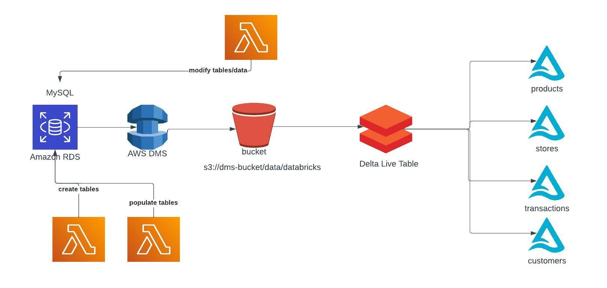
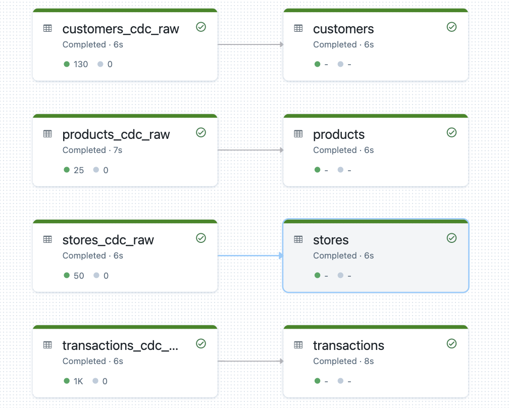
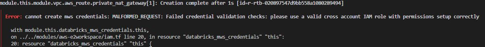

# Using Streaming Delta Live Tables and AWS DMS for Change Data Capture From MySQL
Welcome to the repository for the Databricks Delta Live Tables Change Data Capture using AWS RDS and DMS.

This code base goes along with the following [blog](https://www.databricks.com/blog/2022/09/29/using-streaming-delta-live-tables-and-aws-dms-change-data-capture-mysql.html).

## Reading Resources
* [Terraform Quickstart](https://learn.hashicorp.com/collections/terraform/aws-get-started)
* [Databricks Autoloader](https://docs.databricks.com/ingestion/auto-loader/index.html)
* [Delta Live Table CDC](https://docs.databricks.com/data-engineering/delta-live-tables/delta-live-tables-cdc.html)
* AWS DMS
    * [What is it?](https://docs.aws.amazon.com/dms/latest/userguide/CHAP_Introduction.html)
    * [RDS Replication to S3](https://docs.aws.amazon.com/dms/latest/userguide/CHAP_Source.S3.html)
* AWS RDS
    * [What is it](https://www.techtarget.com/searchaws/definition/Amazon-Relational-Database-Service-RDS)

## Advanced Resources
* [AWS DMS Best Practices](https://www.youtube.com/watch?v=cq1y8Mwxw08)

## Detailed Walkthrough of Terraform Deployment
### Note: The numbering is roughly order of operations but some are ran in parallel

The Terraform does the following deployment
1. Create VPC and 2 Private Subnets
2. Create MySQL RDS
3. Create Lambda Function
    - Creates Role for Lambda
4. Once RDS is created invoke Lambda with "create" param
    - Creates the following tables in database (from var rds_database)
        - products
        - customers
        - transactions
        - stores
5. Invoke Lambda again with "populate" param
    - populates tables with data
6. Create DMS Replicate Instance
    - creates 3 iam roles dms service
7. Create DMS endpoints (MySQL and S3)
    - s3 bucket is created (target)
    - iam role for s3 endpoint to use dms service
8. Create DMS Migration Task (Mysql -> S3)
9. Start DMS Migration
10. Invoke Lambda again with "modify" param
    - Modifies customer and store table data
    - Adds Column 'Country' to stores table with default value of 'US'
11. Create Databricks Instance Profile to read S3
12. Update Policy on DB Cross Account to access Instance Profile created earlier
13. Adds Instance Profile to Databricks Workspace
14. Upload DLT Notebook
15. Create DLT Pipeline
16. Run DLT Pipeline
17. Create Interactive Cluster
18. Upload Analysis Notebook
19. Output url notebook link

## DLT Pipeline DAG

## Exploratory Notebook
[Notebook](resources/utils/dms-mysql-cdc-analysis.py)

## How to run
[See blog Post](LINK TO BLOG)

## Troubleshooting/Questions
* You might run into the following error when running the e2-simple-workspace. This is due a to a race condition when creating the IAM role regiesting the credentials against Databricks. You can just rerun `terraform apply -auto-approve` and it will finish setting up.

* I can't see Bronze Tables in the metastore?
    * the bronze tables are created with `temporary` flag this lets us still keep track of files ingested/checkpointing but they are just not regiestered against the metastore
