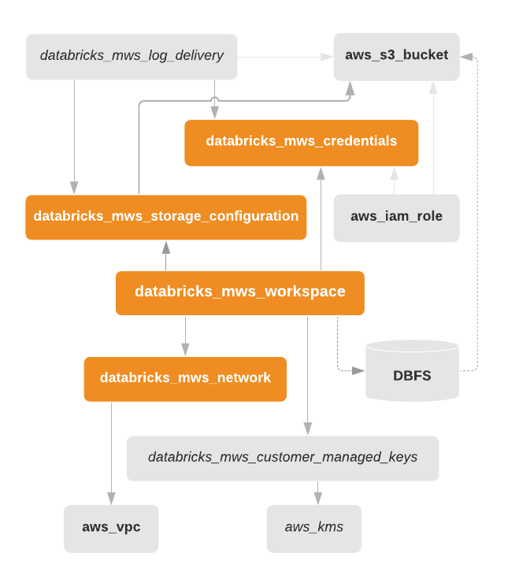

Databricks E2 workspace with BYOVPC

Creates AWS IAM cross-account role, AWS S3 root bucket, VPC with Internet gateway, NAT, routing, one public subnet,
two private subnets in two different regions. Then it ties all together and creates an E2 workspace.

#### Modules

| Name | Source | Version |
|------|--------|---------|
|  [vpc](#module_vpc) | terraform-aws-modules/vpc/aws | 2.70.0 |

#### Resources

| Name | Type |
|------|------|
| [aws_iam_role.cross_account_role](https://registry.terraform.io/providers/hashicorp/aws/latest/docs/resources/iam_role) | resource |
| [aws_iam_role_policy.this](https://registry.terraform.io/providers/hashicorp/aws/latest/docs/resources/iam_role_policy) | resource |
| [aws_s3_bucket.root_storage_bucket](https://registry.terraform.io/providers/hashicorp/aws/latest/docs/resources/s3_bucket) | resource |
| [aws_s3_bucket_policy.root_bucket_policy](https://registry.terraform.io/providers/hashicorp/aws/latest/docs/resources/s3_bucket_policy) | resource |
| [aws_s3_bucket_public_access_block.root_storage_bucket](https://registry.terraform.io/providers/hashicorp/aws/latest/docs/resources/s3_bucket_public_access_block) | resource |
| [databricks_mws_credentials.this](https://registry.terraform.io/providers/databrickslabs/databricks/latest/docs/resources/mws_credentials) | resource |
| [databricks_mws_networks.this](https://registry.terraform.io/providers/databrickslabs/databricks/latest/docs/resources/mws_networks) | resource |
| [databricks_mws_storage_configurations.this](https://registry.terraform.io/providers/databrickslabs/databricks/latest/docs/resources/mws_storage_configurations) | resource |
| [databricks_mws_workspaces.this](https://registry.terraform.io/providers/databrickslabs/databricks/latest/docs/resources/mws_workspaces) | resource |
| [random_string.naming](https://registry.terraform.io/providers/hashicorp/random/latest/docs/resources/string) | resource |
| [aws_availability_zones.available](https://registry.terraform.io/providers/hashicorp/aws/latest/docs/data-sources/availability_zones) | data source |
| [databricks_aws_assume_role_policy.this](https://registry.terraform.io/providers/databrickslabs/databricks/latest/docs/data-sources/aws_assume_role_policy) | data source |
| [databricks_aws_bucket_policy.this](https://registry.terraform.io/providers/databrickslabs/databricks/latest/docs/data-sources/aws_bucket_policy) | data source |
| [databricks_aws_crossaccount_policy.this](https://registry.terraform.io/providers/databrickslabs/databricks/latest/docs/data-sources/aws_crossaccount_policy) | data source |

#### Inputs

| Name | Description | Type | Default |
|------|-------------|------|---------|
|  [cidr_block](#input_cidr_block) | n/a | `string` | `"10.4.0.0/16"` |
|  [databricks_account_id](#input_databricks_account_id) | n/a | `any` | n/a |
|  [databricks_account_password](#input_databricks_account_password) | n/a | `any` | n/a |
|  [databricks_account_username](#input_databricks_account_username) | n/a | `any` | n/a |
|  [region](#input_region) | n/a | `string` | `"eu-west-1"` |
|  [tags](#input_tags) | n/a | `map` | `{}` |

#### Outputs

| Name | Description |
|------|-------------|
|  [databricks_host](#output_databricks_host) | n/a |

<!-- BEGIN_TF_DOCS -->
Databricks E2 workspace with BYOVPC

Creates AWS IAM cross-account role, AWS S3 root bucket, VPC with Internet gateway, NAT, routing, one public subnet,
two private subnets in two different regions. Then it ties all together and creates an E2 workspace.

## Requirements

No requirements.

## Providers

| Name | Version |
|------|---------|
|  [aws](#provider\_aws) | n/a |
|  [databricks](#provider\_databricks) | n/a |
|  [databricks.mws](#provider\_databricks.mws) | n/a |
|  [random](#provider\_random) | n/a |

## Modules

| Name | Source | Version |
|------|--------|---------|
|  [vpc](#module\_vpc) | terraform-aws-modules/vpc/aws | 2.70.0 |

## Resources

| Name | Type |
|------|------|
| [aws_iam_role.cross_account_role](https://registry.terraform.io/providers/hashicorp/aws/latest/docs/resources/iam_role) | resource |
| [aws_iam_role_policy.this](https://registry.terraform.io/providers/hashicorp/aws/latest/docs/resources/iam_role_policy) | resource |
| [aws_s3_bucket.root_storage_bucket](https://registry.terraform.io/providers/hashicorp/aws/latest/docs/resources/s3_bucket) | resource |
| [aws_s3_bucket_policy.root_bucket_policy](https://registry.terraform.io/providers/hashicorp/aws/latest/docs/resources/s3_bucket_policy) | resource |
| [aws_s3_bucket_public_access_block.root_storage_bucket](https://registry.terraform.io/providers/hashicorp/aws/latest/docs/resources/s3_bucket_public_access_block) | resource |
| [databricks_mws_credentials.this](https://registry.terraform.io/providers/databricks/databricks/latest/docs/resources/mws_credentials) | resource |
| [databricks_mws_networks.this](https://registry.terraform.io/providers/databricks/databricks/latest/docs/resources/mws_networks) | resource |
| [databricks_mws_storage_configurations.this](https://registry.terraform.io/providers/databricks/databricks/latest/docs/resources/mws_storage_configurations) | resource |
| [databricks_mws_workspaces.this](https://registry.terraform.io/providers/databricks/databricks/latest/docs/resources/mws_workspaces) | resource |
| [random_string.naming](https://registry.terraform.io/providers/hashicorp/random/latest/docs/resources/string) | resource |
| [aws_availability_zones.available](https://registry.terraform.io/providers/hashicorp/aws/latest/docs/data-sources/availability_zones) | data source |
| [databricks_aws_assume_role_policy.this](https://registry.terraform.io/providers/databricks/databricks/latest/docs/data-sources/aws_assume_role_policy) | data source |
| [databricks_aws_bucket_policy.this](https://registry.terraform.io/providers/databricks/databricks/latest/docs/data-sources/aws_bucket_policy) | data source |
| [databricks_aws_crossaccount_policy.this](https://registry.terraform.io/providers/databricks/databricks/latest/docs/data-sources/aws_crossaccount_policy) | data source |

## Inputs

| Name | Description | Type | Default | Required |
|------|-------------|------|---------|:--------:|
|  [cidr\_block](#input\_cidr\_block) | n/a | `string` | `"10.4.0.0/16"` | no |
|  [databricks\_account\_id](#input\_databricks\_account\_id) | n/a | `any` | n/a | yes |
|  [databricks\_account\_password](#input\_databricks\_account\_password) | n/a | `any` | n/a | yes |
|  [databricks\_account\_username](#input\_databricks\_account\_username) | n/a | `any` | n/a | yes |
|  [region](#input\_region) | n/a | `string` | `"us-west-2"` | no |
|  [tags](#input\_tags) | n/a | `map` | `{}` | no |

## Outputs

| Name | Description |
|------|-------------|
|  [cross\_account\_name](#output\_cross\_account\_name) | n/a |
|  [databricks\_host](#output\_databricks\_host) | n/a |
|  [default\_sg](#output\_default\_sg) | n/a |
|  [private\_subnets](#output\_private\_subnets) | n/a |
<!-- END_TF_DOCS -->