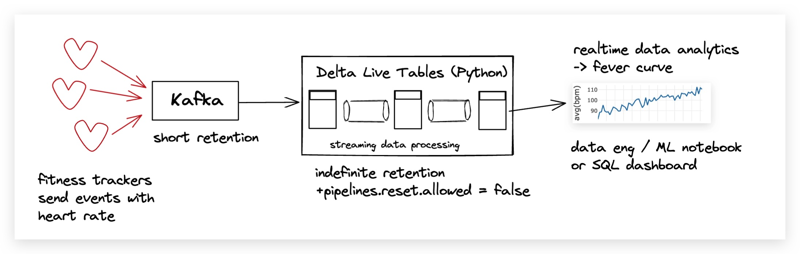
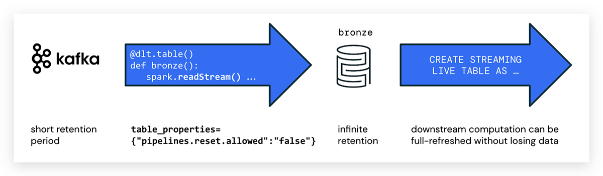

# kafka-dlt-streaminganalytics
Detect COVID cases with Apache Kafka, Databricks Delta Live Tables, and streaming data analytics

## Background Story

In this live demo from [Current.io (Kafka Summit 2022)](https://2022.currentevent.io/website/39543/welcome), I will show data ingestion, cleansing, and transformation based on a simulation of the Data Donation Project [DDP](https://corona-datenspende.de/science/en) built on the lakehouse with Apache Kafka, Spark Structured Streaming, and Delta Live Tables (a fully managed service). DDP is a scientific IoT experiment to determine COVID outbreaks in Germany by detecting elevated heart rates correlated to infections. Half a million volunteers have already decided to donate their heart rate data from their fitness trackers.

## Architecture 

## Notebooks 📔 

* `K-DLT-Python`: Streaming data pipeline with DLT, reading data from Confluent Kafka
* `K-GenerateEvents`: Python event generator
* `K-StreamingDataAnalytics`: Streaming data analytics with Spark Structured Streaming

## Setup

### DBR Version
The features used in the notebooks were tested with the Databricks runtime DBR 10.4 LTS. 

## How to Run the Demo 🚀 ?
### 🐑 Clone the Repo
Use [Databricks Repos](https://docs.databricks.com/repos/index.html#clone-a-remote-git-repository) from your Databricks workspace to clone the repo and kick off the demo. The repo consists of the three notebooks listed above. The workflow definition is not part of the repo.

### 🚀 Running the demo 
* Run the event generation notebook to create events for the Kafka queue 
* Trigger the DLT pipeline. Note, that you have to [create a pipeline first](https://docs.databricks.com/data-engineering/delta-live-tables/delta-live-tables-ui.html) to run it. 
* Run the streaming data analytics notebook.
* Explore what happens if you set `pipelines.reset.allowed=true` in DLT and run a full refresh. 

## Resources

### 🤝 Feedback and contributing

* Blog: [Low Latency Streaming Data Pipelines with Kafka and DLT](https://www.databricks.com/blog/2022/08/09/low-latency-streaming-data-pipelines-with-delta-live-tables-and-apache-kafka.html)
* This demo is provided "as is". Please join the [Databricks Community Forum](https://community.databricks.com/) for technical questions and discussions
* I am happy to accept pull requests but please keep in mind that the focus of this demo is on DLT and simplicity. 
* Follow me on twitter for more Data and AI: [@frankmunz](https://twitter.com/frankmunz). 
