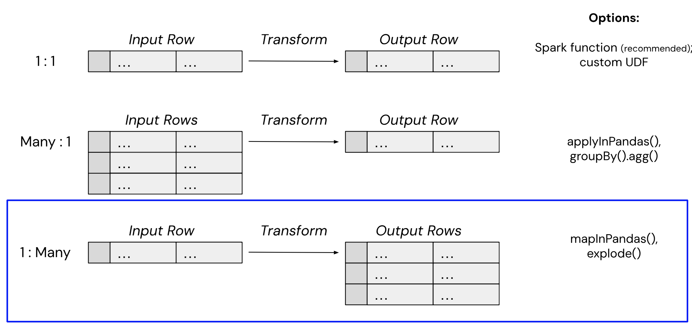
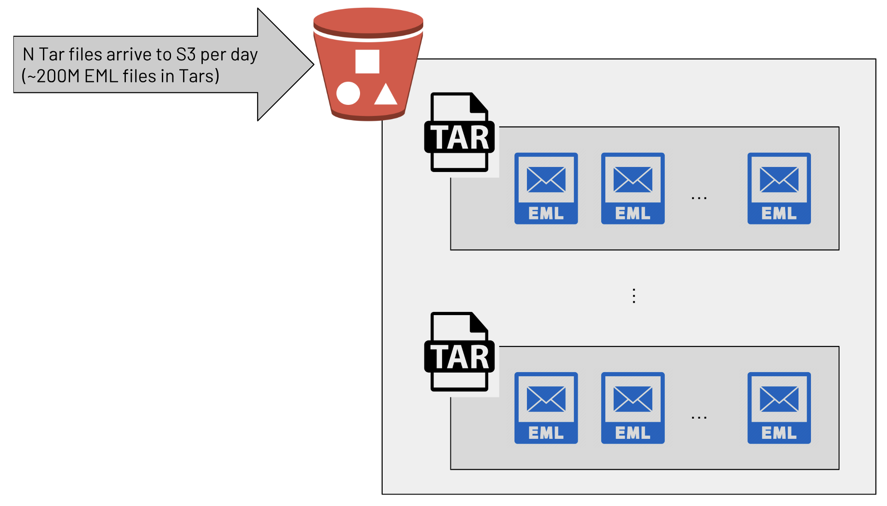
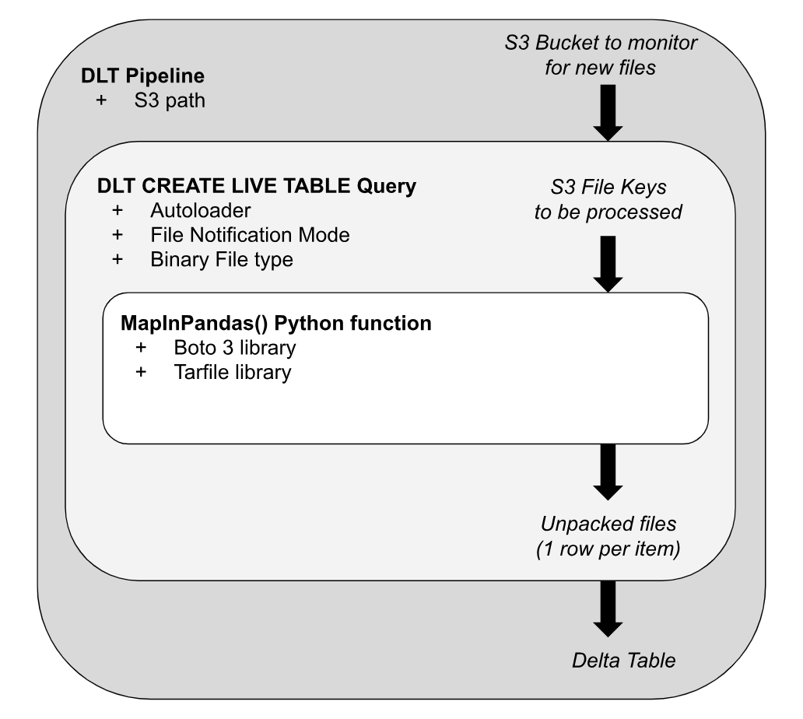
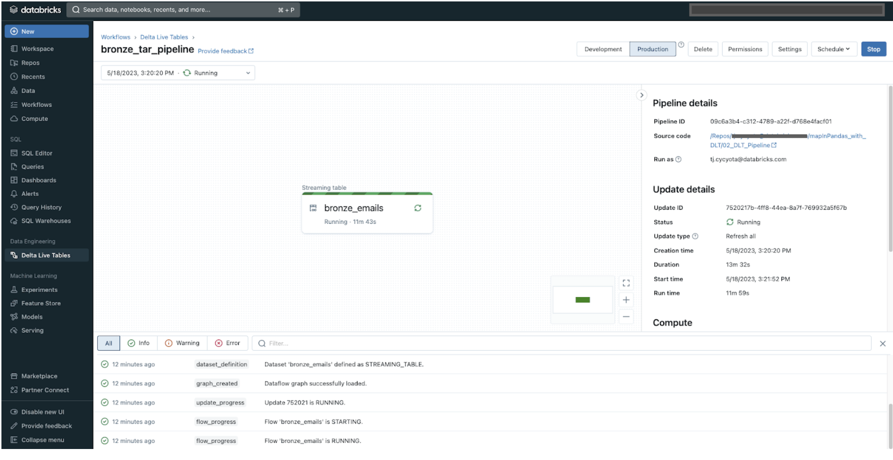
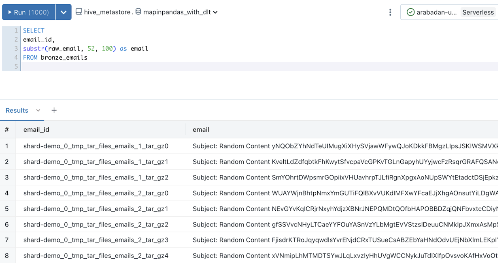

These are accompanying code samples for the blog post `Processing Uncommon File Formats at Scale with MapInPandas() and Delta Live Tables`

# Processing Uncommon File Formats at Scale with MapInPandas() and Delta Live Tables

## Intro
Introduced in Spark 3.0.0., mapInPandas() allows you to efficiently complete arbitrary actions on each row of a Spark DataFrame with a Python-native function and yield more than one return row. This is exactly what is needed to “unpack” or decompress uncommon file formats into usable DataFrame rows while avoiding memory pressure: 



The supporting code in this repo: 
* Describes the data engineering problem to be solved, and a final solution using Delta Live Tables --> `README.md`
* Introduces how to construct a mapInPandas() function --> `00_intro_to_mapInPandas`
* Applies this concept in a basic Spark Structed Streaming query --> `01_StructuredStreaming_Queries`
* Creates a basic [Delta Live Tables](https://www.databricks.com/product/delta-live-tables) pipeline to ingest these complex files --> `02_DLT_Pipeline` and `resources/dlt_config.json`

## Problem: uncommon file formats at scale
From compression/packing standards such as Tar or ZStandard, to proprietry non-Spark formats, even to files saved without a file extension, Data engineers must often deal with uncommon file types. This blog explores a use-case where a data engineering team wanted to process the raw text of emails for cyber security analyses on Databricks. An upstream team provided data in zipped/compressed Tar files, where each Tar contained many email (.eml) files:


## Solution: DLT + MapInPandas for scalable ingestion of any file format
With this understanding of the problem,  let’s see how this customer implemented a scalable architecture to a scenario of unpacking millions emails from Tar files. The diagram below serves as a conceptual model of the architectural steps involved; we’ll start from the outermost component, and work our way inward: 


### DLT Pipeline
Delta Live Tables simplifies the orchestration of complex data pipelines. Even though our example here only includes one table, with this pattern we can easily process multiple S3 locations, create bronze and gold-layer derived tables, and efficiently autoscale to meet unpredictable data arrival patterns in production. The pipeline specification can be found in the source repo, but here is a quick screenshot of our setup: 


When in Production mode, this streaming pipeline will pick up and unpack new Tar files as they arrive on S3. In preliminary testing (non-Photon pipeline, default c5.2xlarge workers), a 30Mb tar can be unpacked in a microbatch lasting ~5 seconds; similarly, a 430Mb file required ~24 seconds. With autoscaling, the DLT cluster will scale to match the incoming file volume, as each worker is executing the unpacking of multiple files in parallel.

We can see that the resulting Delta table (queried from Databricks SQL) contains our synthetic email data, and the email_id column to uniquely identify each unpacked email. For this customer, a given email might be hundreds of MB, so the use of the SQL `substr()` function selects just one part of each very long email for demonstration purposes:



Be sure to check out the source code for this pipeline in the notebook `02_DLT_Pipeline`

## Aside: inspecting UDFs for memory issues
The code snippet below represents the original Spark User Defined Function (UDF) that unpacks a Tar file into a JSON of messages. It is important to note that **this approach is not recommended**, but it is included here to highlight valuable lessons learned from the use of UDFs. In general, it is advisable to avoid Spark UDFs, and further discussion on this topic will be provided later on.

```
#NOTE: NOT RECOMMENDED. Spark UDF, row-by-row implementation
@F.udf
def untar(tar_value):
  f = BytesIO(tar_value.encode("utf-8"))
  message_list = []
  with tarfile.open(fileobj = f, mode='r:') as tf:
      for entry in tf:
          data = tf.extractfile(entry).read().rstrip()
          message_list.append(data.decode('utf-8'))
                
  return json.dumps(message_list)
```

After further investigation, the user defined function tasked with “untarring” files required up to 4x the memory of the final returned email value: 
* The function parameter “tar_value” is copied into memory (2x memory)
* Within the unpacking of a single tar, each email is copied again into the “message_list” variable, bringing memory usage to at least 3x
*As a return value, the function creates a huge JSON string from the content of “message_list”, bringing memory overhead for the single input to 4x
* Finally, the returned content (a JSON message list) is not the intended output: consumers of this data want one row per email (not one row per tar file), so an additional Spark processing step is required to explode() this JSON into the final format. 

Without accounting for how the Python "tarfile" library handles memory and the garbage collection of unreferenced variables, processing a 300MB Tar input with this function could necessitate allocating over 1GB of working memory to a Spark executor for successful execution of a single file. Given that this function was applied in parallel to hundreds of thousands or even millions of Tar files, it becomes evident why Spark clusters would frequently crash.


## Next Step
Continue on to the next notebook, `00_intro_to_mapInPandas`