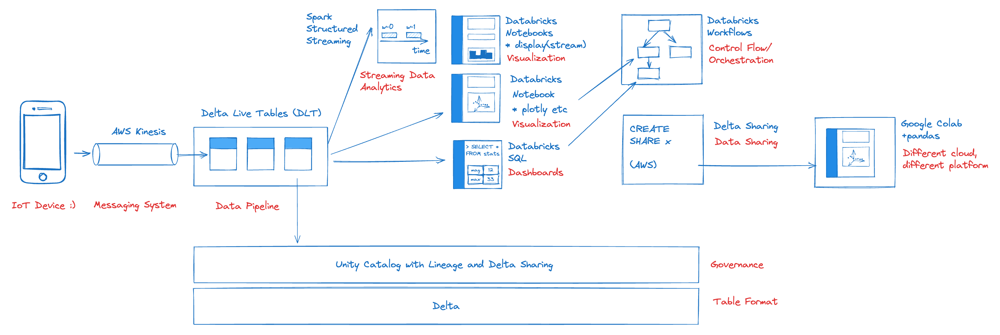
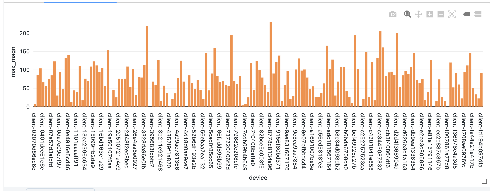

# Distributed Seismograph
A [DAIS 2023 data streaming demo](https://www.databricks.com/dataaisummit/session/embracing-future-data-engineering-serverless-real-time-lakehouse-action) to analyze real IoT events from hundreds of mobile phone accelerometers with an all serverless infrastructure for streaming data pipelines, orchestration, real-time visualization, and data sharing. 

## Background Story

This DAIS demo uses Databricks Delta Live Tables (DLT), Workflows with serverless compute, Databricks SQL serverless. Even with the smallish demo setup at DAIS and WIFI only a sustained throughput of 51 million events/day was supported. 

**Note, this is not a canned demo**. To deploy it and enjoy it, you have to be able to provision a Kinesis stream, a publicly accessible S3 bucket, and an AWS Inkognito pool. If you feel less adventurous, we provide many canned demos that can be run with a simple `pip install` or even without a Databricks account in the [Databricks Demo Center](https://databricks.com/demos)  

## Architecture 

[Architecture diagram [available here](motion.excalidraw)]

## Notebooks 📔 

* `M-DataPipeline DLT`: Streaming data pipeline with DLT, reading data from AWS Kinesis
* `M-Histo`: Streaming histogram over client-id and max(magn)
* `M-Magn SSS`: Streaming real-time data analytics with Spark Structured Streaming
* `M-Heatmap`: Plotly heat map used from Workflow
* `M-Plot`: 3D plot with Plotly
* `DeltaSharing_DAIS2023`: Google Colab Notebook for Delta Sharing
* `M-Plot`: 3D plot with Plotly

## Setup

### DBR Version
Workflows and SQL are serverless. For Spark Structured Streaming and the analytic notebooks a shared cluster running DBR 13.1 was used.
## How to Run the Demo 🚀 ?
### 🐑 Clone the Repo
Use [Databricks Repos](https://docs.databricks.com/repos/index.html#clone-a-remote-git-repository) from your Databricks workspace to clone the repo and kick off the demo. The repo consists of the notebooks listed above. The workflow definition and the serverless SPA is not part of the repo.

### 🚀 Running the demo 
* Set up a Kinesis stream using the AWS console or cloud formation and note the ARN. 
* Create an AWS identity pool with Incognito for the SPA (magn.html). Allow kinesis put operations with the ARN from above for everyone. 
* Edit the SPA and replace the Kinesis stream name and the Incognito pool ID. 
* Put the SPA in an S3 bucket and make it publicly accessible. Make sure you can access it from a mobile device. 
* Configure the DLT pipelines to use the proper AWS keys and Kinesis stream, then run provided DLT pipeline in continuous mode.
* Run the notebooks for the client ID histogram and in another tab the streaming data analytics notebook for the averaged max live display.

### Results

When we were running this demo at DAIS, some attendees achieved a magnitude of over 200 (on a non-calibrated scale). 

I used Delta Sharing to share these results from a Databricks workspace running on AWS.
The results were read on Google Cloud with a Colab notebook as a Pandas data frame without any Databricks workspace installed (see notebook above). 

## Resources

### 🤝 Feedback and contributing

* Blog: [Low Latency Streaming Data Pipelines with Kafka and DLT](https://www.databricks.com/blog/2022/08/09/low-latency-streaming-data-pipelines-with-delta-live-tables-and-apache-kafka.html)
* This demo is provided "as is". Please join the [Databricks Community Forum](https://community.databricks.com/) for technical questions and discussions
* Follow me on twitter for more Data and AI: [@frankmunz](https://twitter.com/frankmunz). 

