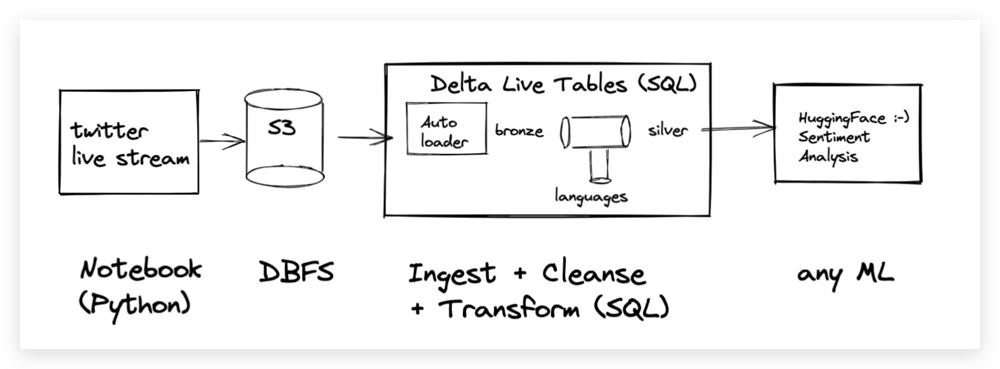
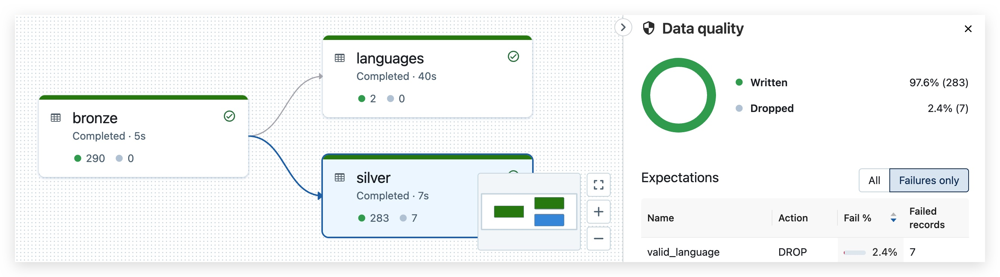
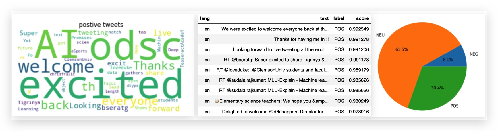
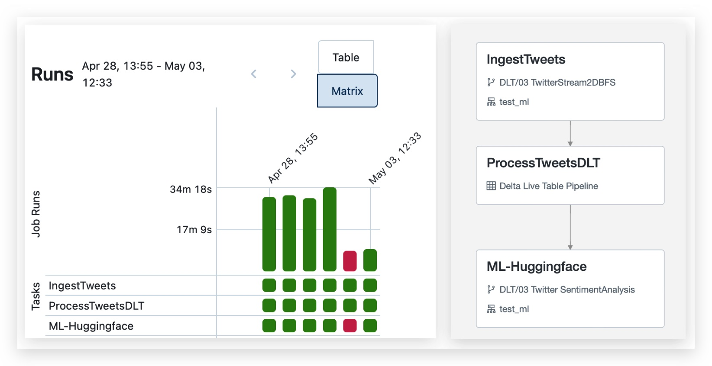

# 👋🏼 What is this Delta Live Table demo?

This Delta Live Tables (DLT) demo was built to have a more realistic data engineering end-to end demo. 
DLT is the first ETL framework that uses a simple declarative approach to building reliable data pipelines and automatically manages your infrastructure at scale. Data analysts and engineers spend less time on tooling and can focus on getting value from data. With DLT, engineers are able to treat their **data as code** and apply **modern software engineering best practices** like testing, error handling, monitoring, and documentation to deploy reliable pipelines at scale.


## Try Databricks for Free

Sign up for a [free Databricks trial](https://databricks.com/try-databricks?itm_data=demos-try-workflows-trial) to explore this demo. 

## The gist

In this demo we are reading a live Twitter stream, ingesting the streaming data with schema detection, cleansing, and transforming the data, and applying a bit of sentiment analysis to the tweets to classify them.




### What this is not

This demo is not a DLT beginners tutorial. The demo was build for users with some knowlegde who are ready to experiment and want to explore more. It's also not a canned demo. You have to bring your own twitter keys and deal with real, live tweets that are ingested as a data stream from Twitter. You should be able to explain and interpret the results. For really cool results I carefully selected the search keys and ingested tweets from events happening at that time.   

## Ingredients
### 📔 The [Twitter-Stream-S3.py notebook](Twitter-Stream-S3.py) uses **[Tweepy](https://www.tweepy.org/)** 👩‍💻

I use Tweepy to ingest a live Twitter stream based on search criteria that can be defined, such as "DLT" and "data engineering". The ingested Twitter data is streamed to an S3 bucket. Just imagine this S3 bucket as your data lake. With Databricks, I can use DBFS to abstract the cloud object store as a folder (DBFS is multicloud, it will work the same on ADFS2 and GCS too)  

```python
# Filter realtime Tweets by keyword and language
try:
    tweet_stream.filter(languages=["en","de","es"], track=["DLT","Delta Live Tables"])
```

### 📔 The [Twitter-Dataflow.sql notebook](Twitter-DataFlow.sql) uses **[Delta Live Tables](https://databricks.com/product/delta-live-tables) in SQL with Auto Loader** 

What matters most in "DLT" is the "P" :-). "P" as in "pipeline" or dataflow. In this example DLT is used together with Databricks Auto Loader. Auto Loader ingests streaming data into the lakehouse and detects the schema. My DLT pipeline follows the [Medallion Architecture](https://databricks.com/glossary/medallion-architecture) and creates a Bronze table for the raw data, then filters the 40 columns per tweet and cleanses the data to ensure only tweets in English are contained in the Silver table. Ensuring data quality is done with SQL constraints (we like to call them Expectations in DLT lingo).   




### 📔 The [Twitter-SentimentAnalysis.py Notebook](Twitter-SentimentAnalysis.py) uses  **Hugging Face Sentiment Analysis Pipelines**

For sentiment analysis, I picked Hugging Face (the Databricks platform is open and flexible, so any ML will work). It doesn't get much easier than using a pretrained Hugging Face language model that is even optimized for tweets. The model detects emojis like :-), 😀, 🥲 and so on. My goal was to show how almost any kind of ML can be used within the Lakehouse - with emphasis on simplicity.




For a more advanced discussion of [Hugging Face with Databricks see the this blog](https://databricks.com/blog/2021/10/28/gpu-accelerated-sentiment-analysis-using-pytorch-and-huggingface-on-databricks.html). 


### ✅ **Databricks Workflows**

If you have seen a recording of this demo, you will remember how I struggled to switch between the different notebooks for the Twitter Stream, DLT, and ML. Of course this needs to be automated! I am using Databricks Workflows for this and simply create three tasks: one for ingestion with the notebook that is using Tweepy, one task that runs the DLT pipeline, and a third task for the sentiment analysis. This is a workflow example that uses different task types, such as Python notebooks and DLT pipelines. 


So if the Workflow is not part of this repository, how can you create your own workflow? Watch this demo about [Databricks Workflows](https://www.youtube.com/watch?v=H2FS4ijpFZA) to get started.


## How to Run the Demo?
### 🐑 Clone the Repo
Use [Databricks Repos](https://docs.databricks.com/repos/index.html#clone-a-remote-git-repository) from your Databricks workspace to clone the repo and kick off the demo. The repo consists of the three notebooks listed above. The workflow definition is not part of the repo.


### Requirements

* Since the data is streamed live from twitter you have to create Twitter credentials. Ideally you should store them as a Databricks secret and read the from the Twitter-Stream-S3 notebook. Since I experiment a lot with this demo and I wanted to keep the code simple, I added the credentials directly but externalized this step into a separate notebook that is not on github.
* Create a directory in DBFS to store the streamed tweets and change the code accordingly. The helper functions that I use for that are at the bottom of the Twitter-Stream-S3 notebook. 
* Define the Tweepy search expression to something that you enjoy. Note for the sake of this demo I include Spanish and German tweets. Later I use Delta Live Table expectations to ensure the ML pipeline will only be applied to EN tweets.
* You can stop the data collection at any time if you like. The code will work with the existing tweets in the DBFS directory. 


### DBR Version
The features used in the notebooks were tested with the Databricks runtime DBR 10.1 ML. Make sure to use a ML runtime, otherwise the notebook with the Sentiment Analysis will complain about missing libraries (which you could install manually, but it is not worth the effort).


### 🚀 Running the demo 
* Run the Twitter-Stream-S3.py notebook that ingests data from Twitter, or make sure you have tweets from a previous run to process
  * At this step you have to provide your Twitter keys
* Trigger the DLT pipeline. Note, that although the pipeline is defined in the Twitter-Dataflow.sql notebook, you have to [create a pipeline first](https://docs.databricks.com/data-engineering/delta-live-tables/delta-live-tables-ui.html) to run it. 
* Run the Twitter-SentimentAnalysis.py notebook to check out the most positive tweets!
* Explore what happens if the silver table is not a streaming DLT. 

optional:
* Create a simple Databricks Workflow as described above. Creating a workflow is easy, but it is not necessary if you just want to explore the notebooks manually. 
* Let's make this fun. Use your own search keys. Run if for Sushi places in your country, or dogs, or beach locations. Make sure to tweet your word clouds and do not forget to add me, so I can see your results! 

### 🤝 More resources
* I delivered that demo live at Data and AI Summit ([recording on YouTube](https://www.youtube.com/watch?v=_yfApABaeBk)) 

### 🤝 Feedback and contributing

* I am happy to accept pull requests but please keep in mind that the focus of this demo is on DLT and simplicity. So I am not looking for more complexity in the ML part, however I'd appreciate other cool visualizations of the final data. 
* A friend of mine, [Srijith](https://www.linkedin.com/in/srijith-rajamohan-ph-d-4242b9a/) provided a first version of the Tweepy code. Databricks is all about collaboration.  
* Follow me on twitter for more Data and AI news: [@frankmunz](https://twitter.com/frankmunz). 

## Try Databricks for Free

Sign up for a [free Databricks trial](https://databricks.com/try-databricks?itm_data=demos-try-workflows-trial) to explore this demo. 
